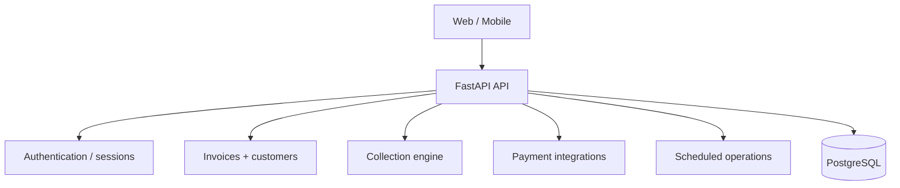

# RecoverFlow — Receivables Operations Platform

Receivables operations platform for SMB workflows covering invoices, overdue cash, follow-ups, payment links, messaging, subscriptions, and scheduled collection operations.

## Product surface

### Web / API
- Authenticated receivables dashboard.
- Invoice creation/import and customer management.
- Collection workflow and follow-up operations.
- Razorpay payment links and WhatsApp integrations.
- Subscription and integration settings.

### Mobile
React Native + Expo client under `mobile/`, using secure token storage and EAS-oriented iOS/Android configuration.

## Architecture



Payment providers and messaging systems remain external trust boundaries.

## Stack

| Layer | Technology |
|---|---|
| Backend | FastAPI, SQLAlchemy, PostgreSQL |
| Security | scrypt, signed sessions, encrypted credentials |
| Integrations | Razorpay, WhatsApp, optional OpenAI |
| Mobile | React Native, Expo, SecureStore |
| Delivery | Render, GitHub Actions |

## Repository map

```text
app/                    # FastAPI application
mobile/                 # React Native / Expo client
docs/                   # operational and product documentation
requirements.txt
Dockerfile / deployment configuration
.github/workflows/
```

## Development

Backend:

```bash
cp .env.example .env
python -m venv .venv
source .venv/bin/activate
pip install -r requirements.txt
```

Mobile:

```bash
cd mobile
npm install
EXPO_PUBLIC_API_URL=<your-api-url> npx expo start
```

Do not place live provider credentials in source control.

## Verification

```bash
python -m compileall -q app
python -c "from app.main import app; print(app.title)"
cd mobile
npx tsc --noEmit
```

CI runs the deterministic backend smoke path and mobile typecheck.

## Payment and automation safety

Keep payment-provider signature validation, webhook verification, idempotency, replay protection, server-side credentials, and safe failure semantics intact.

Scheduled operations must remain secret-gated. Missing external credentials should produce an accurate non-production state rather than silently enabling real-money or customer-facing actions.

## Security model

Treat payment data, customer data, webhook payloads, integration responses, and scheduled-job inputs as untrusted external data. Preserve authentication, authorization, signature verification, secret boundaries, and server-side provider access.

See [SECURITY.md](SECURITY.md).

## Evidence policy

Collection, payment, conversion, reliability, and latency claims require a defined workload/dataset, environment, observation window, denominator, and producing commit.

## Documentation

- [Security](SECURITY.md)
- [OSS stack](docs/OSS_STACK.md)
- [Product roadmap](docs/PRODUCT_ROADMAP.md)

## Contribution standard

Preserve idempotency, payment-signature verification, safe scheduling, authorization boundaries, and accurate failure states. Add regression coverage for changes affecting money movement or customer-visible collection workflows.

## License

MIT
